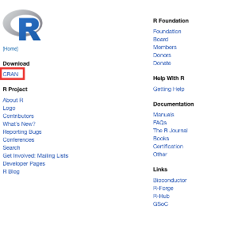

# Installing R 

> 以下中文示範由助教 [\@Amychu0607](https://github.com/orgs/Rstat-project/people/Amychu0607) 提供

## Why should I install R on my computer?

The R Server is cuts down on a lot of installation problems and it means that you have all the packages and functions you need already installed. However, it requires an internet connection to use and additional when it comes time to submit your R assessments, if you don't have R on your computer it means that you won't be able to open the files you download from the server to check they're ok before you submit them.

There are some great detailed walkthrough videos by [Danielle Narvarro on YouTube](https://www.youtube.com/playlist?list=PLRPB0ZzEYegOZivdelOuEn-R-XUN-DOjd) re: how to install R on both Windows and Mac.

## Windows

If you are using Windows, you should download and install the following:

* [R](https://cran.r-project.org/bin/windows/base/)
* [R Studio](https://rstudio.com/products/rstudio/download/#download)
* [RTools](https://cran.r-project.org/bin/windows/Rtools/)

Once you've installed all three programs, restart your computer. Then, open RStudio (not R) and run the below code:

```{r eval = FALSE}
install.packages("tidyverse")
```

This will install the `tidyverse` package on your computer. If you have any problems installing R, please book into a GTA session as they should be able to help you with any installation problems.

## Mac

If you are using a Mac, you should download and install the following:

* [R](https://www.stats.bris.ac.uk/R/)  
* [R Studio](https://rstudio.com/products/rstudio/download/#download)  
* [XQuartz](https://www.xquartz.org/)  

If you have any issues installing R on your Mac, first, we recommend that you watch the [walkthrough by Danielle Navarro](https://www.youtube.com/watch?v=ay25o485YXs&list=PLRPB0ZzEYegOZivdelOuEn-R-XUN-DOjd&index=1&t=113s). 

If you have further issues on Mac, you may find this video helpful [walkthrough video](https://www.youtube.com/watch?v=90IdULVGmYY). Additionally, if you are using a Mac with the Catalina OS, we also recommend you read this [troubleshooting guide](https://psyteachr.github.io/FAQ/installing-r-and-rstudio.html#i-am-using-macos-10.15-catalina)

Once you've installed all three programs, restart your computer. Then, open RStudio (not R) and run the below code:

```{r eval = FALSE}
install.packages("tidyverse")
```

This will install the `tidyverse` package on your computer. If you have any problems installing R, please book into a GTA session as they should be able to help you with any installation problems.

中文操作方式請參考網路資源：https://dotblogs.com.tw/raylee/2019/05/22/113247

### R下載

步驟：

1. 至官方網站下載：https://www.r-project.org/
2. 點選選單左側：CRAN



     
3. 選擇Taiwan 
4. 選擇Download R for macOS
5. 選擇適合自己mac系統的載點（例如：catalina、big sur），按照步驟安裝。

P.s. mac系統可由mac桌面左上角蘋果圖示，點選：”關於這台mac”以確認mac系統。

### 下載R studio

中文操作方式請參考網路資源：https://dotblogs.com.tw/RayLee/2019/05/22/154710

步驟：

1. 前往 Rstudio下載的網址：https://www.rstudio.com/products/rstudio/
2. 點選：R studio Desktop


3. 點選：Download Rstudio Desktop，依照電腦指示安裝。


## Chromebooks

> 台灣有多少學生使用？

Please note that you cannot currently install R on a Chromebook, please use the R Server.
