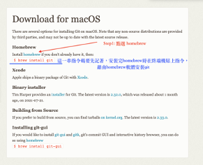
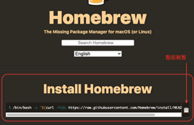
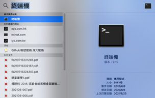

# Git與Github使用技巧

> 以下中文示範由助教 [\@Amychu0607](https://github.com/orgs/Rstat-project/people/Amychu0607) 提供

## 申請Github帳戶

操作方式請參考網路資源：
https://zh-tw.coderbridge.com/@happycoder/a0ca0be3fe1f4f13a8edb72f876b7e3e

步驟：

1. 請點選Github網站：https://github.com/
2. 點選右上角：Sigh up，並依照網頁指示申請帳號和密碼。

## 下載及設定Git

### Mac

步驟：

1. 前往Git Download for macOS網站： https://git-scm.com/download/mac
2. 點選Homebrew

3. 進入Homebrew 頁面，複製紅色底線處的Install Homebrew指令，接著回到桌面。

4. 點按桌面右上角“放大鏡”圖示，輸入：終端機。

P.s.進入終端機頁面之後，終端機會要求輸入筆電螢幕解鎖密碼，才能進行下載Homebrew & Git步驟。如果筆電本身沒有設定密碼，應設定密碼才能進行終端機的指令操作。筆電密碼可至“系統偏好設定（灰色齒輪圖示）⇢使用者與群組”進行密碼設定。

5. 接續於終端機貼上 Install Homebrew頁面提供的指令，按enter。（此步驟為安裝homebrew）

6. 安裝homebrew之後，再輸入/貼上指令：＄brew install git ，按enter。(此步驟為安裝git)

7. 再次貼心提醒，終端機下載homebrew 及 安裝 git，請參考網路資源連結教學進行安裝，並依照影片中提供的方式檢查是否有成功安裝git:  https://gitbook.tw/chapters/environment/install-git-in-mac.html 

