# githubclassroom作業管理 {#githubclassroom}


## 作業資料管理資料夾設置建議

參考來源：[Github classroom for students](https://github.com/jfiksel/github-classroom-for-students) by [Jacob Fiksel](https://github.com/jfiksel)

假設你的電腦主要磁碟機有一個資料夾`Users/myname/`，本課程學習檔案可依此架構存放。

```
Users
│
│
│
└───myname
    │
    │
    │
    └───university-documents
        │
        │
        |
        |---rstat-project-fall-2021
            |
            |
            |
            |---assignments   ## 個人作業
            |
            |
            |---lectures      ## 個人上課筆記
```


> 以下中文示範由助教 [\@Amychu0607](https://github.com/orgs/Rstat-project/people/Amychu0607) 提供，經過數次測試修改。按照步驟發現任何問題，請向老師和助教反映。

> 以下步驟以公開作業"Hello! Git and Github"示範

## 領取作業複本repo

<!---

1. 請點開老師提供的[github classroom課程連結](https://classroom.github.com/classrooms/88956273-rstat-project-ncku-2021fall)

2. 點"Hello! Git and Github"的連結 

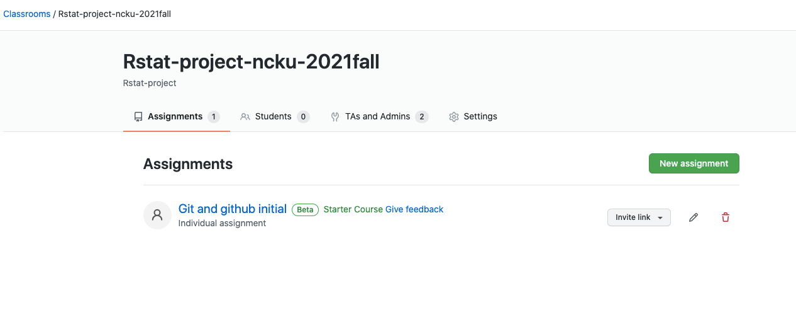


3. 點紅圈處的小圖示copy連結  → 另開一個視窗把copy的網址貼上 


--->

1. 經由moodle訊息(?)取得作業複本連結，開啓網頁點選自已的名字。**示範畫面感謝胡中凡老師友情演出**


2. 下一個畫面點accept，成功出現以下畫面

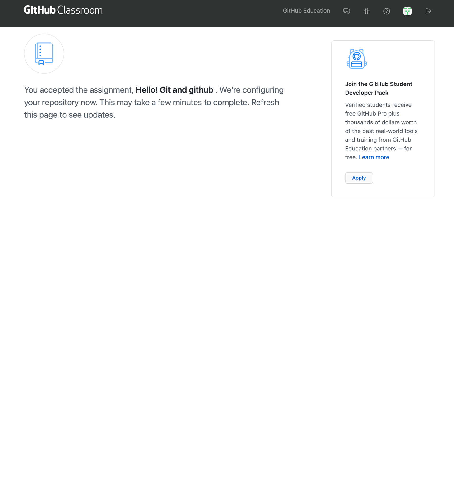

3. 在作業儀表板確認出現自己的名字，點選Go to repo **示範畫面感謝胡中凡老師友情演出**

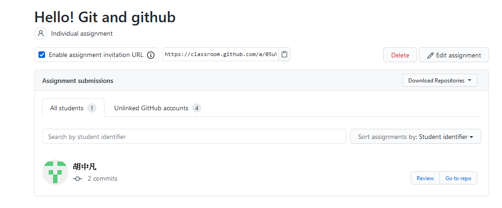

4. 進入自己帳號的repo之後，請再次確認是否為自己的帳號→點Code (代表複製作業檔案) → 複製連結後切換到 Rstudio頁面 

**示範畫面感謝助教[\@Amychu0607](https://github.com/orgs/Rstat-project/people/Amychu0607)友情演出**


**提示1** 作業複本repo存於"Rstat-project"，並非個人的github帳號，僅有領取作業複本的學生、老師與助教有權限存取內容。

**提示2** 學期期間作業複本repo無法拷貝(fork)至個人github帳號。學期結束後寒暑假期間會開放拷貝，提供有需要留存作業的學生自行備份。


## Rstudio 寫作業

### Windows/Mac

1. 打開Rstudio → 點 File → 點New Project 

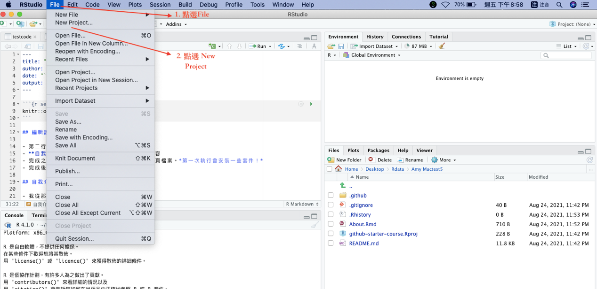


2. 點 Version Control

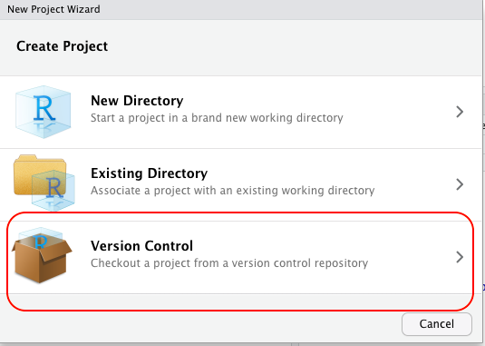


3. 點 Git 

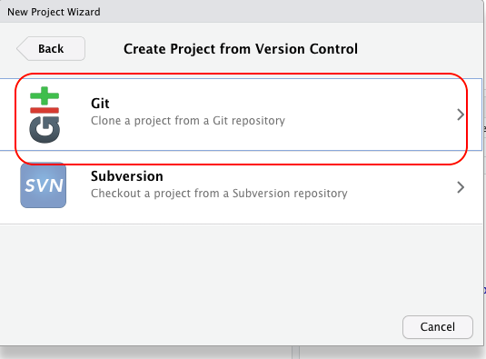

4. 在第一行處貼上Code複製的連結(綠色按鈕點的) → 第二行建立作業的名稱 → 第三行點選Browse ( 作業儲存的資料夾，請以英文命名資料夾名稱) → 按 Create Project

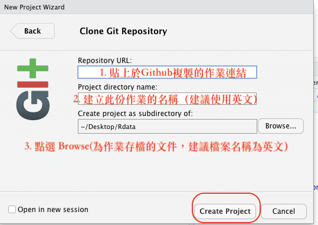

5. 四窗格處右下角，點選檔名About.Rmd的文件 → 作業會出現在四窗格的左上角 → 作業寫完按儲存 → 右上角點 Git → 將文件打勾 → 按 commit 

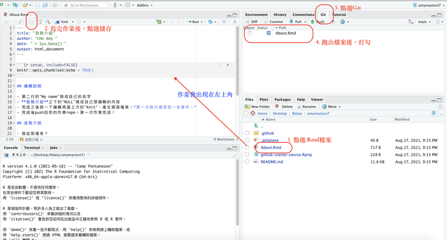

### Rstudio cloud

**Chromebook/公用電腦的同學適用**

1. 確認已有github帳號

2. 向授課教師取得邀請連結。

3. 在瀏覽器網址列使用邀請連結，開啟註冊/登入畫面，選擇github帳號註冊/登入。

4. 進入以下畫面代表登入成功。點選`Join Space`進入Rstudio Cloud。

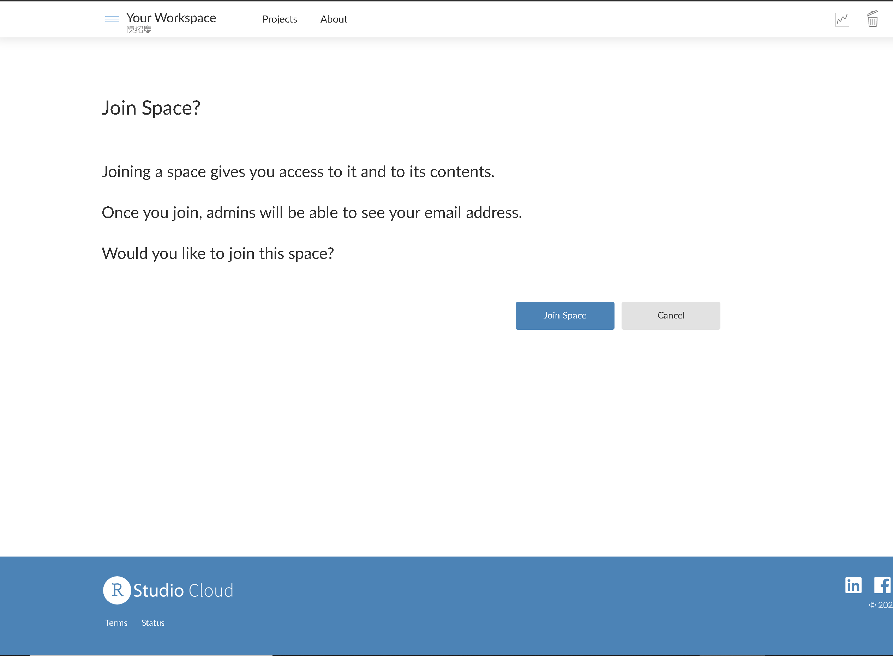

5. 進入工作空間`NCKUPSY-undergarudate-stat-2021`，點選"Projects"，開啓專案清單。


6. 在github確認作業複本repo已經建立。點選`Code`，複製如以下畫面的網址。

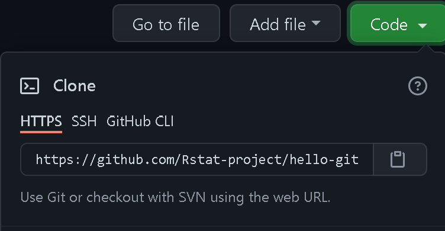

7. 點選`New Project`，再點選`New Project from Git Repository`


8. 在以下畫面貼上第6步複製的網址，按OK即完成建立專案。

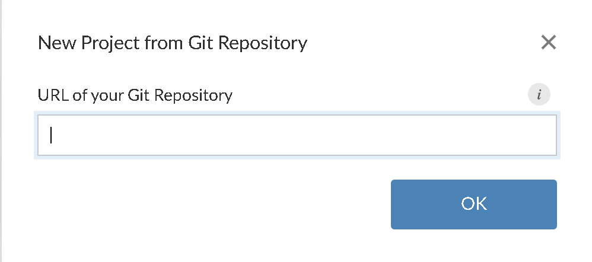


## Rstudio 交作業

1. 進入push作業的畫面 →在右方框處簡單註明作業主述 → 按commit → 按 push繳出作業

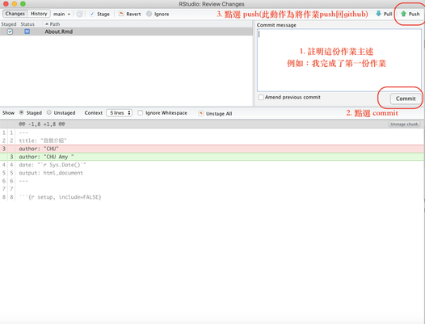

2. 成功commit的畫面如下

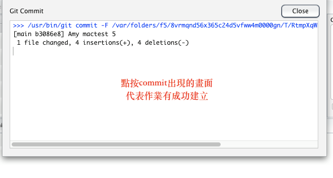

**第一次commit必做設定**

- 任何平台首次安裝git之後，必須設定識別資料，才能進行commit。需要到`terminal`子視窗執行以下指令：

```
git config --global user.name "我的名字"
git config --global user.email "我的email"
```

- 以上"我的名字"與"我的email"，換成個人github帳號與註冊github的email

3. 成功push的畫面如下

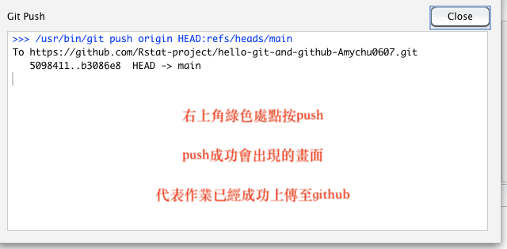

**各作業系統第一次push都會出現要建立SHA或token的提示，請見以下說明**

### 補充：Windows第一次Push 作業會出現的情況

正常會自動開啟預設瀏覽器，只要按照指示點選核可按鈕，完成認證步驟。

### 補充：Rstudio Cloud第一次Push 作業會出現的情況

由於Rstudio Cloud無法建立SHA，必須在個人github帳號製造一個token。步驟如下

1. 從個人github帳號頁面右上角開啟選單，選擇"Settings"

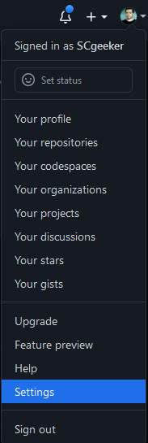

2. 進入後從左側選單，進入"Developer settings"。

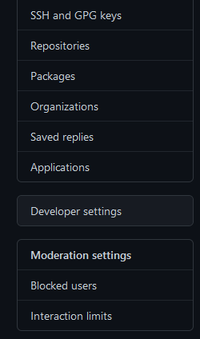


3. 進入後點選"Personal access tokens"，再點選"Generate new token"


4. 輸入密碼之後住入設定頁面。**Note**: 為此token命名; **Expiration**: 設定token有效期限，可設至這學期結束; 必勾選項見以下截圖。設定完畢按最下方"Generate token"


5. 生成成功，將此token儲存在某個文字檔，文字檔務必放在只有個人才能取得的磁碟機或雲端碟碟。**以下截圖是示範用，截圖後已刪除**


### 補充：Mac os 第一次Push 作業會出現的情況


當同學第一次要從Rstudio push 作業到github時，會遇到token驗證的請求（這時候會遇到，輸入Github帳號密碼還是無法push的問題，原因是Git驗證已改為輸入token驗證）。然而，Mac 與 Wins 系統不同在於，第一次進行身份驗證時，Mac不會如同Wins自動導入token輸入的頁面進行驗證，而是要從mac系統中“鑰匙圈”進行後台修改。

**因此，mac 取得token的方式 & 從“鑰匙圈”修改git token 的步驟，請參考網路資源：https://myctw.github.io/post/bd72.html**

修改完畢之後，再回到Rstudio ，重新commit 和push 作業，Rstudio同樣會再顯示出輸入帳號密碼的請求，這時再輸入一次github帳密進行驗證。

- 若遇到下列問題：

1. **依照上述步驟仍驗證不過**，再點選一次push，但這次將輸入密碼時的密碼改為輸入token代碼試試。

2. **若跳出指令出現下列類似字樣**:

```
git config --global user.email “youremail.com”
git config --global user.name “your name”
```

請將提示中的上述兩行字樣指令複製，並在Rstudio左下方框處，點選”Terminal”，並貼上上述指令，將user name替換成個人Github帳號，user email替換成申請Github帳號時的email，按enter，進行資料設定。

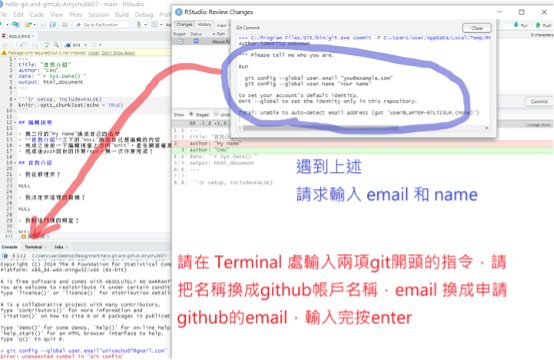

3. **若嘗試過1.2的解決方法，還是無法push出作業**

請回到桌面 → 點右上角放大鏡（Spotlight）→ 輸入：終端機 → 進入終端機之後 → 將下列兩字串輸入（同樣將user name 和 user email改為github的帳戶名稱，以及申請github帳戶的email）→ 按 enter 


```
git config --global user.email “youremail.com”
git config --global user.name “your name”
```


## 在命令列介面交作業

Rstudio的**Terminal**子視窗同Windows 10的**命令提示字元**、Mac OS的**終端機**。熟悉流程後，可在任何界面進入作業資料夾路徑，輸入以下指令完成作業上傳。


```
git add .
git commit -m "what I have done."  ## 雙引號內可換成輸入任何紀錄文字
git push
```
